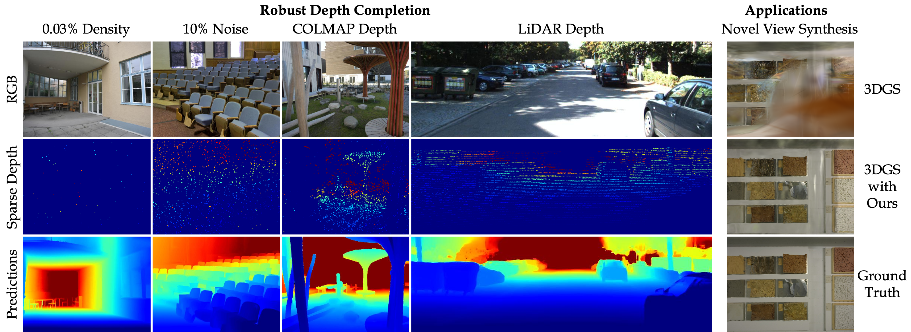

# 

<p align="center">

  <h1 align="center">OMNI-DC: Towards Highly Robust Depth Completion</h1>
  <p align="center">
    <a href="https://zuoym15.github.io/"><strong>Yiming Zuo</strong></a>
    ·
    <a href="https://www.linkedin.com/in/liu-willow-yang-787b82210/"><strong>Willow Yang</strong></a>
    ·
    <a href="https://mazeyu.github.io/"><strong>Zeyu Ma</strong></a>
    ·
    <a href="https://www.cs.princeton.edu/~jiadeng/"><strong>Jia Deng</strong></a>    
  </p>
  <p align="center">
    <a href="https://pvl.cs.princeton.edu/">Princeton Vision & Learning Lab (PVL)</a>    
  </p>
</p>

<h3 align="center"><a href="">Paper</a>  · </a><a href="">Project</a> </a></h3>

<p align="center">
  <a href="">
    
  </a>
</p>

## TL;DR
We present a depth completion model that works well on unseen datasets and various depth patterns (zero-shot). It can be used to regularize Gaussian Splatting models to achieve better rendering quality, or work with LiDARs for dense mapping.

## Environment Setup
We recommend creating a python enviroment with anaconda.
```shell
conda create -n OMNIDC python=3.8
conda activate OMNIDC
# For CUDA Version == 11.3
conda install pytorch==1.10.1 torchvision==0.11.2 torchaudio==0.10.1 cudatoolkit=11.3 -c pytorch -c conda-forge
pip install mmcv==1.4.4 -f https://download.openmmlab.com/mmcv/dist/cu113/torch1.10/index.html 
pip install mmsegmentation==0.22.1 
pip install timm tqdm thop tensorboardX tensorboard opencv-python ipdb h5py ipython Pillow==9.5.0 plyfile eniops
```

#### NVIDIA Apex

We used NVIDIA Apex for multi-GPU training. Apex can be installed as follows:

```shell
git clone https://github.com/NVIDIA/apex
cd apex
git reset --hard 4ef930c1c884fdca5f472ab2ce7cb9b505d26c1a
conda install cudatoolkit-dev=11.3 -c conda-forge
pip install -v --no-cache-dir --global-option="--cpp_ext" --global-option="--cuda_ext" ./ 
```

You may face the bug `ImportError: cannot import name 'container_abcs' from 'torch._six'`. In this case, change line 14 of apex/apex/_amp_state.py to `import collections.abc as container_abcs` and re-install apex.

#### Backbone Initialization Files
Download these `.pt` files to `src/pretrained`:
```
https://drive.google.com/drive/folders/1z2sOkIJHtg1zTYiSRhZRzff0AANprx4O?usp=sharing
```


## Reproduce Results in the Paper 

#### Download checkpoints
Download from 
```
https://drive.google.com/file/d/1SBRfdhozd-3j6uorjKOMgYGmrd578NvG/view?usp=sharing
```
and put it under the `checkpoints` folder.

#### Prepare the datasets

We save all evaluation datasets in a unified form (uniformat), and you can directly download it from [here](https://drive.google.com/file/d/1hCNnjKy0R8yU1_lqqTIUUBYJwrz2Bz71/view?usp=sharing).
Put all npy files under the `datasets/uniformat_release` folder:

```
uniformat_release
  ├───ARKitScenes_test_100
  │   ├──000000.npy
 ...  ├──000001.npy
      └──...           
```


We also provide instructions on how to process the original datasets to get them, check [this link](src/robust_dc_protocol/README.md):  

#### Testing
```
cd src

# the real and virtual patterns from the 5 datasets reported in tab.1 and tab.2 in the paper
sh testing_scripts/test_robust_DC.sh

# additional results on the void and nyuv2 datasets
sh testing_scripts/test_void_nyu.sh
```
## Test on Your Own Dataset

We recommend writing a dataloader to save your own dataset into the uniformat. You will need to provide an RGB image and a sparse depth map (with 0 indicating invalid pixels). A good starting point is the [ibims dataloader](src/data/ibims.py). 

Then follow the instructions [here](src/robust_dc_protocol/README.md) to convert your dataset into uniformat. Specifically, look into `src/robust_dc_protocol/save_uniformat_dataset.py`.

Once done, you can run evaluation just as on any other datasets we tested on. See examples under `src/testing_scripts`.

If you want to use our model for view synthesis (e.g., Gaussian Splatting), you may find the instructions [here](src/robust_dc_protocol/README.md) helpful. The ETH3D section describes how to 
convert COLMAP models to sparse depth maps.

## Train from Scratch 

#### Resource requirements
We use 10x48GB GPUs (e.g., RTX A6000) and ~6 days. You can adjust the batch size depending on the memory and the numbers of GPU cards you have. 

#### Dataset preparation
See [here](Training.md) for instructions.

#### Training
```
cd src
sh training_scripts/train_full.sh 
```

## Citation 


